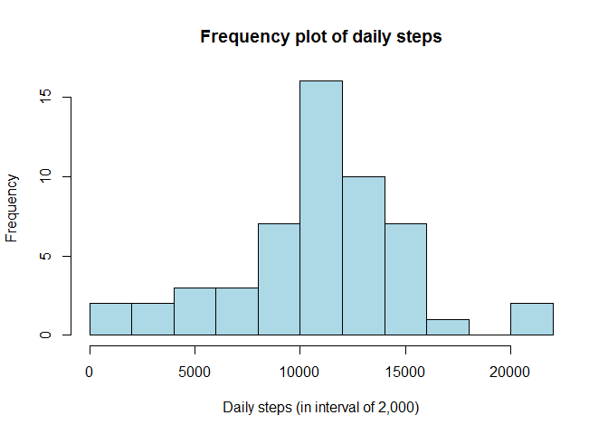

# Personal Movement Analysis
Jim Perkins  
November 13, 2016  


```r
knitr::opts_chunk$set(echo = TRUE)
library(readr)
library(dplyr)
```

```
## 
## Attaching package: 'dplyr'
```

```
## The following objects are masked from 'package:stats':
## 
##     filter, lag
```

```
## The following objects are masked from 'package:base':
## 
##     intersect, setdiff, setequal, union
```

```r
#/ read the dataset
dataset<- read_csv("./activity.csv")
```

```
## Parsed with column specification:
## cols(
##   steps = col_integer(),
##   date = col_date(format = ""),
##   interval = col_integer()
## )
```

```r
steps_by_day <- count(dataset, date, wt = steps)
```
#### Part 1 

> *For this part of the analysis, we ignored missing values (i.e. we stripped out any "NA" values*  
> *from the dataset before calculating the mean, median and the frequency plot.*


```r
knitr::opts_chunk$set(echo = TRUE)

steps <- as.data.frame(  steps_by_day[,2] )  
non.zero.steps <- steps$n[steps$n != 0]      #/remove all NA's from the data set 

x <- mean(non.zero.steps)
f.mean_steps_perday <- format(round(x,1),big.mark = ",")

y <- as.numeric(median(non.zero.steps))
f.median_steps_perday <- format(y, big.mark = ",")
```


* Over the 2 month measurement period...  
 + AVERAGE steps per day was: **10,766.2**  
 + MEDIAN  steps per day was: **10,765** 


Here is a frequency plot (i.e. histogram) of the total steps taken each day


```r
knitr::opts_chunk$set(echo = TRUE)

# xt <- xtable(summary(steps_by_day))
# print(xt, type="html" )

#/Histogram of steps
myTitle <- "Frequency plot of daily steps"
xlabel <- "Daily steps (in interval of 2,000)"
hist(non.zero.steps, breaks = 10, col = "light blue", xlab = xlabel, main = myTitle)
```

<!-- -->

> *Meaning: The most frequently occurring steps in a day are between 10,000 to 12,000*  


 
 

 
