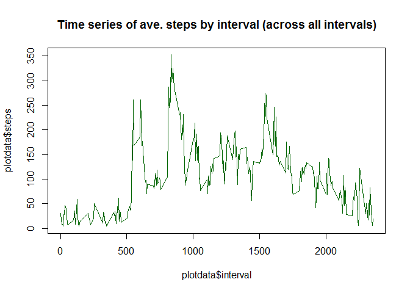

# Personal Movement Analysis
Jim Perkins  
November 13, 2016  


#### Part 1 

> *For this part of the analysis, we ignored missing values (i.e. we stripped out any "NA" values*  
> *from the dataset before calculating the mean, median and the frequency plot.*


```r
knitr::opts_chunk$set(echo = TRUE)

steps <- as.data.frame(  steps_by_day[,2] )  
non.zero.steps <- steps$n[steps$n != 0]      #/remove all NA's from the data set 

x <- mean(non.zero.steps)
f.mean_steps_perday <- format(round(x,1),big.mark = ",")

y <- as.numeric(median(non.zero.steps))
f.median_steps_perday <- format(y, big.mark = ",")
```


Over the 2 month measurement period: AVERAGE steps per day was: **10,766.2** and the MEDIAN  steps per day was: **10,765** 


Here is a frequency plot (i.e. histogram) of the total steps taken each day


```r
knitr::opts_chunk$set(echo = TRUE)
#/Histogram of steps
myTitle <- "Frequency plot of daily steps"
xlabel <- "Daily steps (in interval of 2,000)"
hist(non.zero.steps, breaks = 10, col = "light blue", xlab = xlabel, main = myTitle)
```

<!-- -->

> *Meaning: The most frequently occurring steps in a day are between 10,000 to 12,000*  


```r
knitr::opts_chunk$set(echo = TRUE)

x <- select(dataset, interval, date, steps) %>% filter(steps >0) 
tmp <- arrange(x, interval)
plotdata <- aggregate(x = tmp, by = list(tmp$interval), FUN = "mean")
title <- "Time series of ave. steps by interval (across all intervals)"
plot(plotdata$interval, plotdata$steps, type="l", main=title, col="dark green" ) 
```

<!-- -->

 Which interval and day has the highest average steps?

```r
knitr::opts_chunk$set(echo =TRUE)
plotdata[which.max(plotdata$steps),]
```

```
##    Group.1 interval       date    steps
## 86     835      835 2012-10-27 352.4839
```


 
 

 
